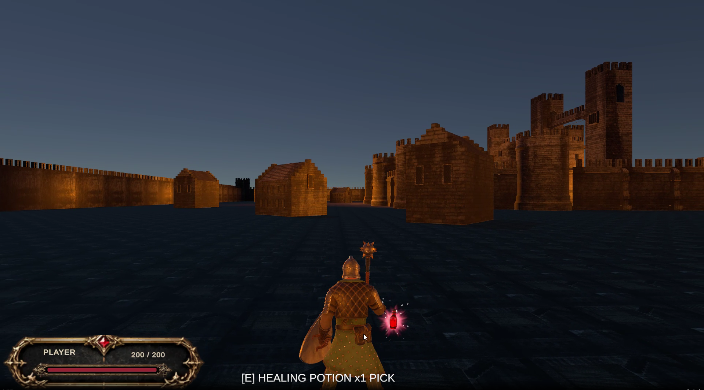
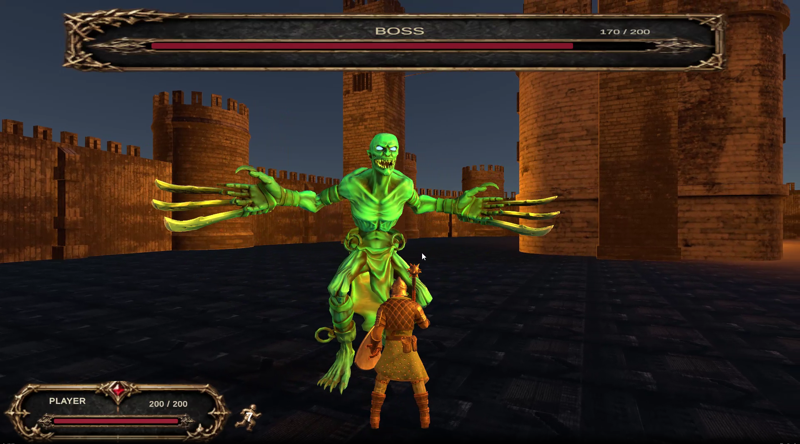
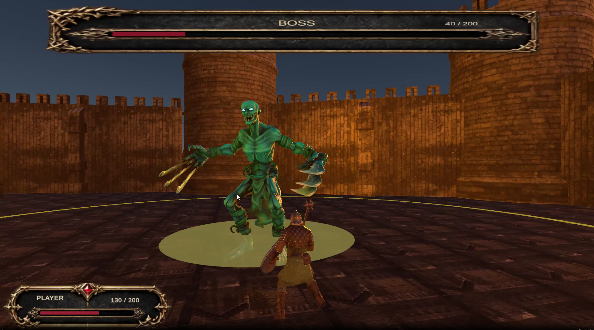
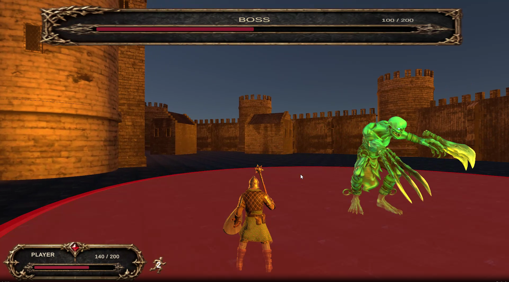
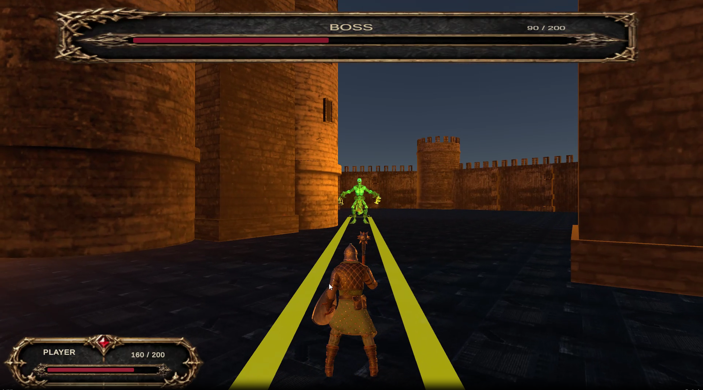
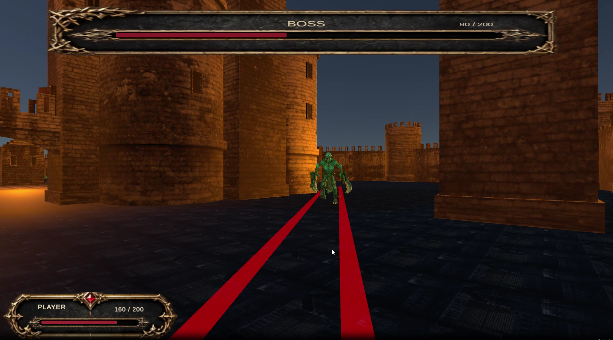
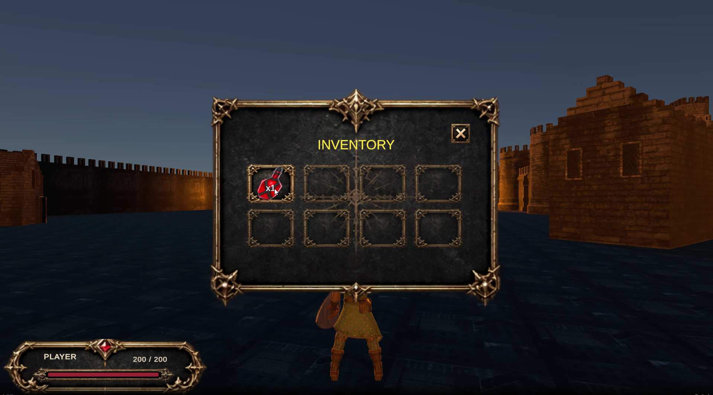
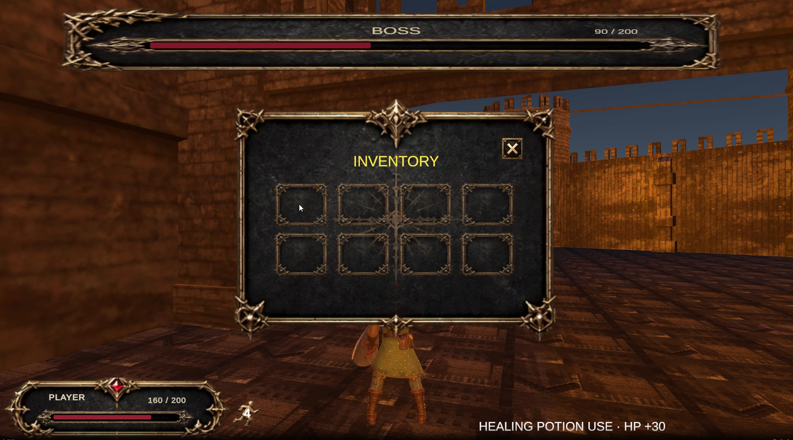

# 3D Boss Action

Unity로 개발 중인 개인 3D 액션 게임입니다.

성곽과 건물이 배치된 필드를 자유롭게 탐험하며 잡몹과 전투하고, 회복 아이템을 확보해 보스에 도전합니다. 공격·패링·구르기를 활용하는 근접 전투와 보스의 페이즈별 패턴을 중심으로 구현했습니다.

| 항목 | 내용 |
| --- | --- |
| 개발 형태 | 개인 프로젝트 |
| 장르 | 3D 액션 |
| 플랫폼 | PC / Windows |
| 개발 환경 | Unity 2022.3.62f1, C# |
| 주요 기술 | Input System, AI Navigation, Animator, ScriptableObject, UGUI, TextMeshPro |
| 개발 기간 | 2026.06~ |
| 진행 상태 | 전투·보스 패턴·인벤토리 구현 완료, 콘텐츠 확장 및 완성도 개선 중 |

## 플레이 흐름

1. 메인 메뉴에서 게임을 시작합니다.
2. 필드를 탐험하며 자율 이동 중인 잡몹과 전투합니다.
3. 잡몹이 떨어뜨린 회복 아이템을 주워 인벤토리에 보관합니다.
4. 보스에게 접근하면 보스 체력 UI가 나타나고 전투가 시작됩니다.
5. 근접 공격·범위 공격·돌진에 대응하며 필요할 때 물약으로 회복합니다.
6. 보스 처치 시 승리, 플레이어 사망 시 패배 처리됩니다.

## 주요 기능

### 플레이어 전투

- **이동과 방향 전환**: 카메라 기준 이동과 마우스 위치를 이용한 방향 전환을 구현했습니다.
- **근접 공격**: 공격 지점을 중심으로 범위를 검사하고, 애니메이션 타이밍에 맞춰 피해를 처리합니다.
- **패링**: 유효 시간 안에 패링 가능한 공격을 받아내면 피해를 막고 반격 피해를 줍니다.
- **구르기**: 회피 중 무적 시간을 적용하며, 사용 후 남은 쿨타임을 체력 UI 옆에 표시합니다. 다시 사용할 수 있으면 쿨타임 아이콘을 숨깁니다.
- **피격과 사망**: 체력 감소, 피격 경직, 사망 및 패배 처리를 연결했습니다.

### 적 AI와 길찾기

- FSM으로 대기·자율 이동, 추적, 공격, 피격, 사망 상태를 관리합니다.
- 대기 상태에서는 주변의 이동 가능한 지점을 찾아 배회합니다.
- 플레이어가 감지 범위에 들어오면 추적하고, 추적 해제 거리 밖으로 멀어지면 자율 이동으로 돌아갑니다.
- NavMesh 경로를 이용해 장애물을 우회하며, 실제 이동과 중력은 CharacterController로 처리합니다.
- 공격 가능 거리와 장애물을 검사해 벽 너머로 근접 공격이 적용되는 상황을 제한합니다.
- 잡몹과 보스는 공통 적 로직을 사용하며 체력·공격력·공격 범위 등을 Inspector에서 조절합니다.

### 보스 페이즈와 특수 패턴

| 패턴 및 기능 | 동작 |
| --- | --- |
| 일반 공격 | 근접 범위에서 공격하며 공격 사이에 쿨타임 적용 |
| 페이즈 전환 | 체력이 설정된 비율 이하가 되면 2페이즈로 전환 |
| 범위 특수 공격 | 외곽 테두리로 범위를 표시하고, 노란 원이 중심에서 확장된 뒤 빨간색 타격 표시로 전환 |
| 돌진 | 준비 애니메이션과 경고 영역을 표시한 뒤 방향을 확정해 돌진 |
| 돌진 충돌 처리 | 이동 중 플레이어·장애물·NavMesh 경계를 검사하고 종료 후 회복 시간 적용 |
| 특수 상태 보호 | 범위 특수 공격·돌진 상태에서는 패링 반격에 의한 경직 차단 |
| 피격 피드백 | 피격 모션 대신 짧은 색 변화로 보스가 피해를 받았음을 표시 |

범위 특수 공격과 돌진은 패링 불가 공격으로 처리합니다. 보스 체력 UI는 교전 중에 표시하며, 잡몹 처치는 승리 조건에 포함하지 않습니다.

### 인벤토리와 회복 아이템

- 잡몹 사망 시 설정된 확률로 회복 물약을 드랍합니다.
- 가까운 아이템을 획득해 기본 8칸 인벤토리에 보관합니다.
- 같은 아이템 데이터는 설정된 최대 수량까지 한 슬롯에 중첩합니다.
- 슬롯을 클릭하면 물약을 사용하고 체력을 회복합니다.
- 최대 체력일 때는 물약을 소모하지 않습니다.
- 공간이 부족하면 아이템을 획득하지 않고 바닥에 남깁니다.
- 인벤토리를 연 동안 플레이어의 이동·공격·패링·구르기 입력을 차단합니다.
- 인벤토리를 열어도 전투는 계속되며, 실제 피격 시 창을 닫습니다.

| 인벤토리 조작 | 입력 |
| --- | --- |
| 가까운 아이템 획득 | `E` |
| 인벤토리 열기 / 닫기 | `I` |
| 회복 아이템 사용 | 슬롯 클릭 |

### UI와 사운드

- 메인 메뉴, 설정 화면, 플레이어 체력, 보스 체력, 회피 쿨타임, 인벤토리 UI를 구성했습니다.
- 체력 변경 이벤트를 통해 체력 UI를 갱신합니다.
- 공격·피격·패링 성공·구르기·발자국 효과음을 연결했습니다.
- 돌진 및 범위 특수 공격의 준비 시점에 효과음을 재생합니다.
- 메인 메뉴와 인게임에 각각 BGM을 적용했습니다.

## 구현 구조

### 상태 전환과 행동 처리

`EnemyController`가 상태 객체를 생성하고, `StateMachine`이 현재 상태의 `Enter`, `Update`, `Exit`를 실행합니다. 상태 객체는 전환할 때마다 새로 만들지 않고 재사용합니다.

| 구성 요소 | 역할 |
| --- | --- |
| `StateMachine` / `IState` | 상태 전환과 상태별 실행 규약 |
| `IdleState` | 배회 목적지 선택, 이동, 플레이어 감지 |
| `ChaseState` | 추적과 공격 상태 진입 판단 |
| `AttackState` | 일반 공격 시작·종료와 쿨타임 처리 |
| `HitState` / `DeadState` | 피격 경직과 사망 처리 |
| `SpecialAttackState` | 범위 특수 공격의 타격·회복·종료 관리 |
| `ChargeState` / `BossChargeAttack` | 돌진 준비·이동·충돌·회복 처리 |
| `EnemyAnimationEvents` | 애니메이션 이벤트를 전투 로직에 전달 |

### 경로 계산과 실제 이동 분리

`NavMesh.SamplePosition`으로 이동 가능한 위치를 찾고, `NavMesh.CalculatePath`로 계산한 경로의 코너를 따라 이동합니다. 실제 위치 변경은 `CharacterController.Move`로 처리합니다.

이 구조에서 NavMesh는 경로 계산을 담당하고, CharacterController는 충돌과 이동을 담당합니다. 중력과 돌진 이동도 CharacterController를 통해 처리합니다.

### 아이템 데이터와 획득·사용 처리 분리

| 구성 요소 | 역할 |
| --- | --- |
| `HealingItemData` | ScriptableObject 기반 이름·아이콘·회복량·최대 중첩 수 데이터 |
| `EnemyLootDrop` | 잡몹 사망 시 드랍 확률과 생성 위치 처리 |
| `WorldItemPickup` | 바닥 아이템의 종류·수량 및 획득 처리 |
| `PlayerItemInteractor` | 근처 아이템 탐색, 장애물 검사, 획득 입력과 안내 |
| `PlayerInventory` | 슬롯·수량 관리, 아이템 추가와 사용 |
| `InventoryUI` / `InventorySlotUI` | 창 표시, 슬롯 아이콘·수량 갱신, 클릭 입력 |

아이템의 설정값은 데이터 에셋으로 관리하고, 월드 외형과 인벤토리 표시를 분리했습니다. 물약 모델이나 아이콘을 교체할 때 획득·회복 로직을 수정하지 않아도 됩니다.

## 인게임 플레이

### 필드 탐험

### 보스 전투

### 범위 특수 공격

### 인벤토리

## 현재 범위와 향후 계획

- [ ] 포탈을 통한 다른 맵 이동
- [ ] 맵 이동 시 플레이어 체력·인벤토리 유지
- [ ] 건물 오르기 등 탐험 기능 검토
- [ ] 적 이동 로직과 보스 전용 로직의 책임 분리
- [ ] 전투 밸런스 및 맵 구성 개선

## 에셋 활용

플레이어는 Modular Fantasy Knight, 적은 Ghoul 모델을 활용했습니다. 외부 모델·애니메이션·UI·음원 에셋을 사용하며, 게임 로직과 에셋 연결 작업은 프로젝트에서 구현했습니다.

외부 에셋의 사용 및 재배포 범위는 각 에셋의 이용 조건을 따릅니다.

